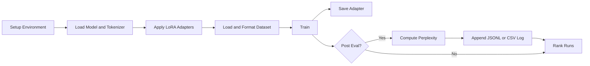

# Fine-Tuning-SLM

<p align="center">
	
</p>

<p align="center">
	<a href="#"></a>
	<a href="#"></a>
	<a href="#"></a>
	<a href="#"></a>
	<a href="#"></a>
</p>

<p align="center">
	A polished, interview-ready ML fine-tuning pipeline: train, evaluate, resume, and rank experiments with one consistent workflow.
</p>

<p align="center">
	<a href="#problem">Problem</a> •
	<a href="#solution">Solution</a> •
	<a href="#architecture">Architecture</a> •
	<a href="#demo-command">Demo Command</a> •
	<a href="#results">Results</a> •
	<a href="#why-this-matters">Why This Matters</a>
</p>

Fine-tune small language models with Unsloth + LoRA using CLI or notebook flow, with built-in support for checkpoint resume, automatic post-training evaluation logging, and reproducible run ranking.

## Problem

Interview demos for ML projects often fail because they are fragmented: one script for training, another for evaluation, no reproducible metrics log, and no clean way to compare runs.

## Solution

This project provides one coherent workflow that is easy to explain live:

- Train LoRA adapters with one configurable script
- Resume from checkpoints without custom patching
- Auto-log post-training perplexity in JSONL or CSV
- Run standalone generation/perplexity validation
- Rank experiments by perplexity or loss from saved logs
- Launch an end-to-end demo from one command for recruiters/interviewers

## Architecture

| File | Purpose |
|---|---|
| `finetune.py` | Main training pipeline (LoRA, resume, post-eval logging) |
| `evaluate.py` | Generation and perplexity evaluation utility |
| `summarize_eval_logs.py` | Aggregates JSONL/CSV logs into a ranked table |
| `FineTuning.ipynb` | Notebook-based workflow for interactive runs |
| `requirements.txt` | Python dependencies |
| `run_demo.sh` | One-command interview/recruiter walkthrough |

## Workflow Diagram



## Demo Command

Run this single command to show the full pipeline from start to finish:

```bash
bash run_demo.sh
```

Common variants:

```bash
bash run_demo.sh --quick --skip-install
bash run_demo.sh --full
bash run_demo.sh --quick --skip-install --max-steps 16
```

## Results

What this demo command produces automatically:

- LoRA adapter checkpoint
- Trainer output/checkpoints
- Post-training eval metrics log
- Standalone generation and perplexity report
- Ranked experiment table

Typical quick-run artifacts are written under `demo_runs/<timestamp>/`:

- `lora/`
- `train/`
- `eval_metrics.jsonl`
- `evaluate_report.txt`
- `ranking.txt`

Example metrics from a real quick run:

- Post-eval perplexity: `3.7807`
- Standalone eval perplexity: `3.7747`

## Why This Matters

- Shows end-to-end ML ownership, not just model training
- Demonstrates reproducibility with logged metrics and ranked runs
- Makes technical storytelling easier in interviews
- Reduces live-demo risk with one consistent command path

## Environment

- Python 3.10+
- Linux or Colab
- NVIDIA GPU with CUDA recommended

## Quick Start

```bash
python3 -m venv .venv
source .venv/bin/activate
pip install --upgrade pip
pip install -r requirements.txt
```

## One-Command Interview Demo

Run this once to execute the full story: train, post-eval log, standalone eval, and ranked summary.

```bash
bash run_demo.sh
```

Helpful variants:

```bash
# Faster rerun when dependencies are already installed
bash run_demo.sh --quick --skip-install

# Longer showcase run
bash run_demo.sh --full

# Force a custom step count
bash run_demo.sh --quick --skip-install --max-steps 16
```

The script writes timestamped artifacts under `demo_runs/` so every run is preserved.

## Training Playbook

Show all options:

```bash
python finetune.py --help
```

Baseline run:

```bash
python finetune.py \
	--model-name unsloth/Phi-3-mini-4k-instruct-bnb-4bit \
	--dataset-name sunny199/pharma-instruction-data \
	--split train \
	--epochs 1 \
	--per-device-bs 2 \
	--grad-acc-steps 4 \
	--lr 2e-5 \
	--output-dir phi3_outputs \
	--lora-save-path phi3_pharma_lora
```

Longer stability run with a fixed step budget:

```bash
python finetune.py \
	--model-name unsloth/Phi-3-mini-4k-instruct-bnb-4bit \
	--dataset-name tatsu-lab/alpaca \
	--split train[:256] \
	--per-device-bs 1 \
	--grad-acc-steps 1 \
	--max-seq-length 512 \
	--max-steps 128 \
	--output-dir stability_outputs \
	--lora-save-path stability_lora
```

Resume training from a checkpoint:

```bash
python finetune.py \
	--model-name unsloth/Phi-3-mini-4k-instruct-bnb-4bit \
	--dataset-name tatsu-lab/alpaca \
	--split train[:256] \
	--per-device-bs 1 \
	--grad-acc-steps 1 \
	--max-seq-length 512 \
	--max-steps 160 \
	--output-dir stability_outputs \
	--lora-save-path stability_lora \
	--resume-from-checkpoint stability_outputs/checkpoint-128
```

### Automatic post-training eval logging

Log to JSONL (default-friendly for append history):

```bash
python finetune.py \
	--model-name unsloth/Phi-3-mini-4k-instruct-bnb-4bit \
	--dataset-name tatsu-lab/alpaca \
	--split train[:128] \
	--max-steps 64 \
	--output-dir autoeval_outputs \
	--lora-save-path autoeval_lora \
	--post-eval \
	--eval-dataset-name tatsu-lab/alpaca \
	--eval-split train[:16]
```

Log to CSV:

```bash
python finetune.py \
	--model-name unsloth/Phi-3-mini-4k-instruct-bnb-4bit \
	--dataset-name tatsu-lab/alpaca \
	--split train[:128] \
	--max-steps 64 \
	--output-dir autoeval_outputs \
	--lora-save-path autoeval_lora \
	--post-eval \
	--eval-log-path autoeval_outputs/eval_metrics.csv
```

## Evaluation and Ranking

Run standalone generation plus perplexity evaluation:

```bash
python evaluate.py \
	--base-model unsloth/Phi-3-mini-4k-instruct-bnb-4bit \
	--adapter-path sanity_lora \
	--dataset-name tatsu-lab/alpaca \
	--split train[:32]
```

Rank experiments by perplexity (lower is better):

```bash
python summarize_eval_logs.py --root . --sort-by perplexity
```

Rank experiments by average loss and show top 10:

```bash
python summarize_eval_logs.py --root . --sort-by avg_loss --top-k 10
```

## Notebook path

Open `FineTuning.ipynb` and run cells in order for an interactive flow.

## Practical notes

- The script expects CUDA by default; use `--allow-cpu` only for debugging.
- LoRA adapters are written to `--lora-save-path`.
- Use `--save-merged` when you also need a merged fp16 model.
- Use `--resume-from-checkpoint` with `--output-dir` to continue interrupted runs.
- Use `--post-eval` to append eval metrics automatically after each run.
